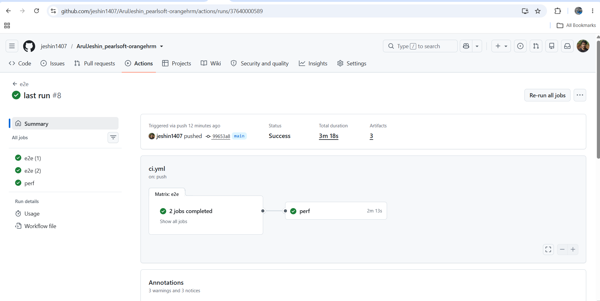
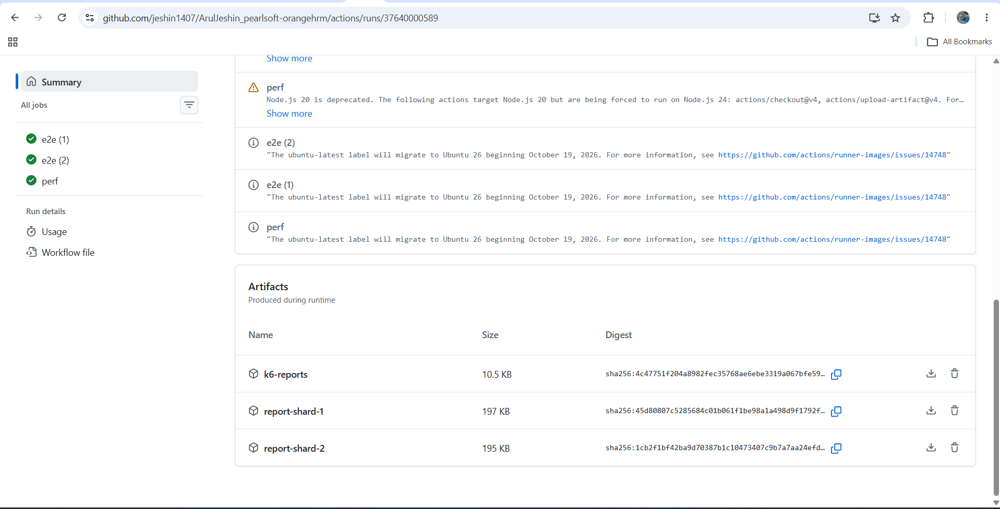

<<<<<<< HEAD
# OrangeHRM test automation (Pearlsoft technical assessment)

End to end, API and performance tests for the OrangeHRM employee module, built with Playwright,
TypeScript and k6.

- Repository: https://github.com/jeshin1407/ArulJeshin_pearlsoft-orangehrm
- Latest green CI run: https://github.com/jeshin1407/ArulJeshin_pearlsoft-orangehrm/actions/runs/37640000589




## What is covered

| Area                         | Tests                                                                                |
| ---------------------------- | ------------------------------------------------------------------------------------ |
| Authentication               | Admin login, wrong password, unknown user                                            |
| Employee create              | Create in the UI, check the record through the API                                   |
| Employee update              | Change the name in the UI, check after reload and through the API                    |
| Employee delete              | Delete in the UI, check the list and the API                                         |
| Employee lifecycle           | Create, update and delete in one journey with API checks in between                  |
| Role based access (ESS user) | Menu hides Admin and PIM, direct admin URL is blocked, admin API refuses the session |
| Performance (k6, bonus)      | Login API and employee creation API with thresholds and HTML reports                 |

The application under test is the public OrangeHRM demo, `https://opensource-demo.orangehrmlive.com`.
It is shared and resets every day, so every test creates its own data and cleans it up.

## Why Playwright with TypeScript

Auto waiting, a built in API client, sharding, traces, video and an HTML report come with the tool,
so the framework code stays small and focused on the application.

## Setup

Prerequisites: Node 20 or newer, Git. k6 only for the performance tests.

```bash
git clone https://github.com/jeshin1407/ArulJeshin_pearlsoft-orangehrm.git
cd ArulJeshin_pearlsoft-orangehrm
npm ci
npx playwright install chromium
```

The demo environment works without any further setup, because `.env.demo` holds the public demo
login that is printed on the demo site itself.

## Environments

The `ENV` variable picks the file `.env.<ENV>`. The default is `demo`.

| File           | Purpose                                             |
| -------------- | --------------------------------------------------- |
| `.env.demo`    | Public demo site                                    |
| `.env.staging` | Placeholder. Replace `BASE_URL` with a real address |
| `.env.example` | Template for a new environment                      |

Rules, implemented in `src/config/env.ts`:

1. A real environment variable wins over the file.
2. An empty variable is ignored, so a missing CI secret falls back to the file.
3. No credentials are hardcoded in code. A missing value stops the run with a message that names it.
4. Passwords for other environments are never committed. Give `ADMIN_PASS` as an environment
   variable or a CI secret.

## Running the tests

```bash
npm test                 # everything
npm run smoke            # @smoke
npm run regression       # @regression without @quarantine
npm run rbac             # @rbac
npm run quarantine       # only @quarantine, never blocks
npm run test:staging     # uses .env.staging (works on Windows, Mac and Linux)
npx playwright test --headed
npx playwright test --debug
npx playwright test tests/e2e/employee/update.spec.ts
```

Windows PowerShell with a custom environment: `$env:ENV="staging"; $env:ADMIN_PASS="..."; npm test`

Code quality checks, also run in CI:

```bash
npm run typecheck
npm run lint
npm run format:check
```

## Tagging strategy

Tags are set with Playwright's `tag` option on each test.

| Tag                                       | Meaning                                                                             |
| ----------------------------------------- | ----------------------------------------------------------------------------------- |
| `@smoke`                                  | Fast critical path                                                                  |
| `@regression`                             | Full functional suite                                                               |
| `@e2e` `@auth` `@employee` `@rbac` `@api` | Feature areas                                                                       |
| `@quarantine`                             | Known flaky. Excluded from the main run and executed in its own non blocking CI job |

No test is quarantined right now. The mechanism is in place for the day one is needed.

## Folder structure

```text
.github/workflows/ci.yml        CI pipeline
src/
  config/                       env loader and paths
  constants/                    api routes, UI routes, visible texts
  api/                          BaseApi, EmployeeApi, UserApi
  components/                   MenuComponent, ToastComponent, TableComponent
  pages/                        BasePage, LoginPage, DashboardPage, PimPage,
                                AddEmployeePage, EmployeeDetailsPage
  fixtures/index.ts             API clients, page objects, seeded data with teardown
  utils/                        dataFactory, logger, waits
tests/
  auth.setup.ts                 logs in once and saves the session
  e2e/auth/login.spec.ts
  e2e/employee/                 create, update, delete, lifecycle
  e2e/rbac/ess-access.spec.ts
perf/                           k6 scripts, shared helpers and HTML reports
scripts/                        run-k6, ci-summary, snapshot-report
sample-reports/                 committed sample Playwright report
docs/screenshots/               CI screenshots used in this README
```

## Key design decisions

**Page Object Model with components.** Pages hold actions and assertions about their own screen.
Parts that appear on several screens (menu, toast, table) are components, so no test or page repeats
a selector. OrangeHRM has no test id attributes, so the code prefers role, placeholder and label
locators, and the few `.oxd-*` CSS selectors are kept inside page and component classes only.

**One way to get things done.** Every test uses the same fixtures. Tests never build page objects or
API clients by hand.

**Fixtures own the test data.** `employee` and `essUser` create data through the API and the
`cleanup` fixture removes it after the test, pass or fail. Tests contain no try and finally blocks.
Order matters and is handled: the ESS user is deleted before its employee.

**Small independent tests.** Create, update, delete, login and each access rule are separate tests
that can run alone and in parallel. One lifecycle test remains as a readable end to end journey.

**API for setup, checks and cleanup, UI for user flows.** The API client never asserts. It returns
data or throws an `ApiError` with the status and body, and tests decide what to assert.

**Session reuse.** The setup project logs in once per run and saves `.auth/admin.json`. API calls
use the same session through the `adminRequest` fixture. Tests that need a logged out browser use
`test.use({ storageState: LOGGED_OUT })`, so screenshots, video and traces still apply to them.

**Unique data per test.** Names, employee ids and user credentials are generated per call from time,
worker index and a counter. Passwords are random and never stored in the repo.

**Exact row targeting.** The employee search matches part of an id and the demo site is shared.
Delete and the "not listed" check use the row whose cell equals the exact id, so a test can never
delete another person's record.

**No credentials in code, config validated at start.** See Environments above.

**Structured logging.** `src/utils/logger.ts` writes levelled log lines. `LOG_LEVEL=debug` shows
every API call. Cleanup problems are logged as warnings instead of being ignored.

## Stability and reliability

- **Retries:** two retries in CI only. Locally there are none, so a failure shows up at once.
- **Smart waiting:** no fixed sleeps. Tests use web first assertions, wait for the specific network
  response that matters (save, search), wait for forms to fill before typing, and use `pollUntil`
  for state that settles later, such as a deleted record leaving the API.
- **Evidence on failure:** screenshot, video and a trace on the first retry, for every test.
- **Cleanup that cannot fail a test:** cleanup helpers return a boolean and log, they do not throw.

### Flaky test detection

1. Playwright marks a test flaky when it fails and then passes on retry.
2. CI runs `scripts/ci-summary.js` on the merged results. The run page shows passed, failed and
   flaky totals, and lists every flaky test by name.
3. A nightly scheduled run executes the full suite, so flakiness shows up as a trend and not only
   on pull requests.
4. To reproduce one locally: `npx playwright test --repeat-each=20 --grep "<test name>"`.

### Flaky test mitigation

1. Find the root cause first. In this project the real causes were a form that fills after the page
   appears, a partial match in the id search on shared data, and a session that expires between API
   calls.
2. Prefer role and label locators over long CSS.
3. Keep tests independent, each with its own data and cleanup.
4. Reuse the login session instead of logging in for every test.
5. Treat retries as a safety net, not a fix.
6. Tag a test that keeps flaking with `@quarantine`. It leaves the blocking run and keeps running in
   the separate non blocking job until it is fixed.

## CI pipeline

`.github/workflows/ci.yml` runs on push to main, on pull requests, nightly, and manually.
The manual run accepts an environment and a tag.

| Job          | What it does                                                                                                       |
| ------------ | ------------------------------------------------------------------------------------------------------------------ |
| `quality`    | Type check, lint and format check. Fails fast before any browser starts                                            |
| `e2e`        | Installs dependencies and the browser, runs tests in 2 parallel shards, uploads a blob report and failure evidence |
| `report`     | Merges the shard blobs into one HTML report, JUnit and JSON, and writes the summary on the run page                |
| `quarantine` | Runs `@quarantine` tests on manual and nightly runs. Never blocks                                                  |
| `perf`       | Runs the k6 scripts and uploads their reports. Bonus part, never blocks                                            |

Parallelism is two levels: shards across machines, workers inside each machine.
Secrets used: `ADMIN_USER`, `ADMIN_PASS`. An optional repository variable `BASE_URL` can point the
pipeline at another environment.

Artifacts per run: `html-report` (one merged report plus JUnit and JSON), `test-results-<shard>`
(screenshots, videos, traces of failures), `k6-reports`.

## Reports and observability

- HTML report: `npm run report`. In CI, download the `html-report` artifact.
- JUnit and JSON: `results/` locally, inside the `html-report` artifact in CI.
- Screenshots, videos, traces: `test-results/` locally, `test-results-<shard>` artifacts in CI.
- A sample report is kept in `sample-reports/`. Refresh it after a green run with
  `npm test && npm run report:sample`.
- k6 HTML reports: `perf/reports/`.

## Performance tests (k6)

```bash
k6 version
npm run perf:login
npm run perf:employee
```

`scripts/run-k6.js` passes the same `BASE_URL`, `ADMIN_USER` and `ADMIN_PASS` that the Playwright
tests use, so there are no credentials inside the k6 scripts.

| Script                    | Load                        | Thresholds                                                               |
| ------------------------- | --------------------------- | ------------------------------------------------------------------------ |
| `perf/login.js`           | up to 5 virtual users, 70 s | failed requests under 1 percent, p95 under 1.5 s, checks over 99 percent |
| `perf/employee-create.js` | up to 2 virtual users, 55 s | failed requests under 5 percent, p95 under 2 s, checks over 95 percent   |

The load is deliberately small. The target is a shared public demo site, and the results are
indicative only. Real load numbers need a dedicated environment. The demo site also rejects a
second API call on a login session, so the create script signs in on every iteration.

## Known limitations and next steps

- The demo site is shared and resets daily, so timing varies between runs.
- The role checks cover the ESS role. Other roles (for example a supervisor) are a next step.
- The ESS role id comes from `ESS_ROLE_ID` and defaults to the demo's value.
- Next: visual checks, Slack alerts for flaky tests, and a dedicated test environment.
=======
# ArulJeshin_pearlsoft-orangehrmV2
Pearl Soft-Assessment
>>>>>>> c1c2d3cdd4f0309a3993aa6b8ca362c4ae166317
"# ArulJeshin_pearlsoft-orangehrmV2" 
